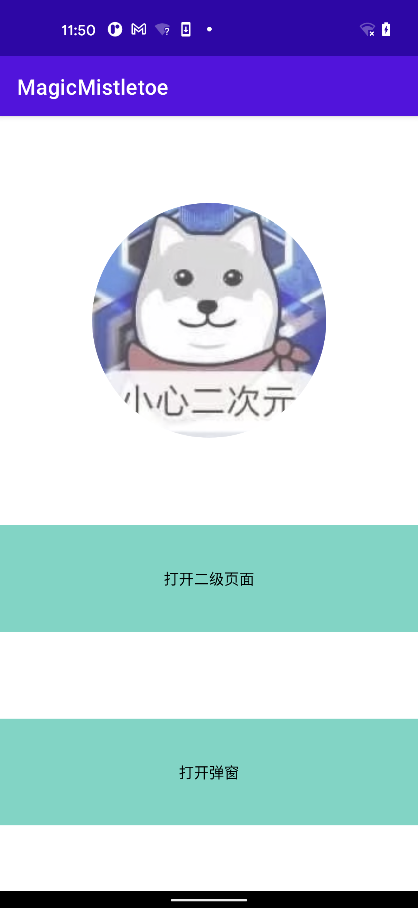
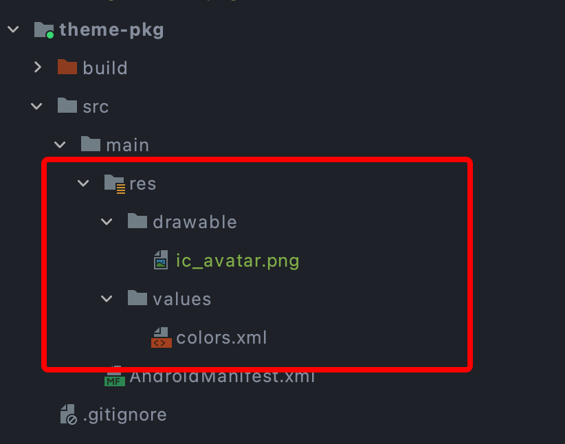
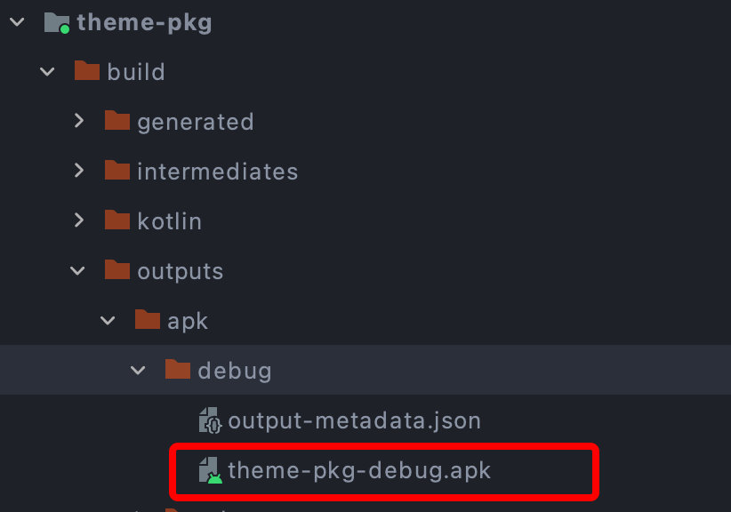
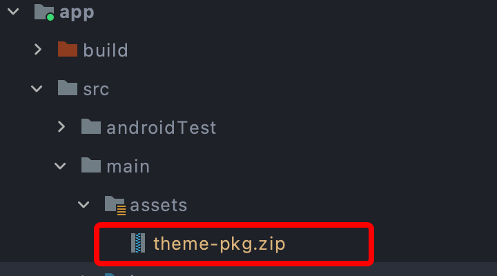
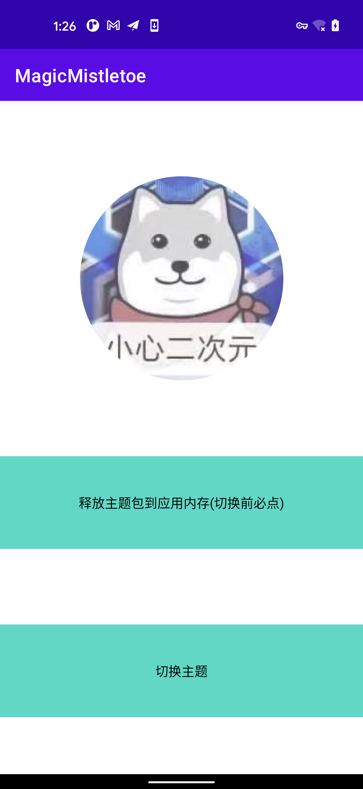
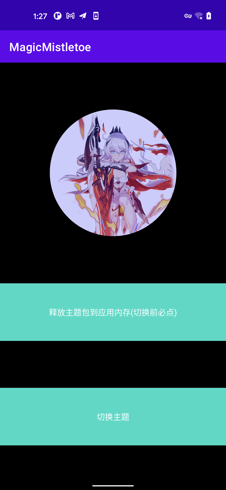

### Magic Mistletoe Android多主题（换肤）切换框架 [](https://jitpack.io/#mistletoe5215/MagicMistletoe)

  #### 背景
 
  > 时隔四年，在网易换肤之前的思路下，做了几点改进，现在完全通过反射创建View，并且在`SkinLoadManager`中提供一个`configCustomAttrs`以支持自定义View的属性插队替换
  
  > 摈弃了之前的`AsyncTask`,使用kotlin 协程进行主题包的资源转换
  
  > 使用kotlin重构所有Java代码实现
 
  ### 功能简述

  > 支持页面、弹窗的主题切换
  > 支持Android 夜间模式
  > 支持自定义主题资源下发

  #### 效果展示
  > 整体效果
  
  <iframe
  src="https://github.com/mistletoe5215/MagicMistletoe/blob/master/snapshots/2021-08-23-114506.mp4"
  scrolling="no"
  border="0"
  frameborder="no"
  framespacing="0"
  allowfullscreen="true"
  height=600
  width=800>
  </iframe>
  
  > 默认主题

  
  
  > 点击切换主题

  
  
  #### 最佳使用方式
  
  > STEP 1 宿主项目(示例Demo为本项目`app`模块)依赖多主题框架AAR
 
   ```groovy
   //in root build.gradle
   allprojects {
 		repositories {
 			maven { url 'https://jitpack.io' }
 		}
 	}
   // in app/module build.gradle
   dependencies {
   	        implementation 'com.github.mistletoe5215:MagicMistletoe:1.0.0'
   	}
 
  ```

  > STEP 2 制作多主题包 
 
  > 找个壳工程(本Demo为`theme-pkg`模块)，在res下放置资源文件，`注意` 资源文件名称需要与`宿主app`内的资源文件名称保持一致，这样主题切换的时候才可以成功替换

  
  
  > 执行打包命令

  
  
  > 找到生成的资源apk

  
  
  > 重命名为`你喜欢的名字.zip`（如果有强迫症）

  
  
  > 这里是做演示，（实际商用过程中，可将zip包给服务端，进行主题包签名处理，后通过下载的形式down到本地，解签，应用）拷贝主题文件至`宿主app`的assets目录下

  
  
  > 释放assets目录主题文件至私有路径

  ```kotlin
     private fun copyAssetAndWrite(fileName: String): Boolean {
            try {
                val cacheDir = cacheDir
                if (!cacheDir.exists()) {
                    cacheDir.mkdirs()
                }
                val outFile = File(cacheDir, fileName)
                if (!outFile.exists()) {
                    val res = outFile.createNewFile()
                    if (!res) {
                        return false
                    }
                } else {
                    if (outFile.length() > 10) { 
                        return true
                    }
                }
                val `is`: InputStream = assets.open(fileName)
                val fos = FileOutputStream(outFile)
                val buffer = ByteArray(1024)
                var byteCount: Int
                while (`is`.read(buffer).also { byteCount = it } != -1) {
                    fos.write(buffer, 0, byteCount)
                }
                fos.flush()
                `is`.close()
                fos.close()
                return true
            } catch (e: IOException) {
                e.printStackTrace()
            }
            return false
        }
  ```
 > STEP 3 XML中需要更换主题的控件设置好多主题属性` multiTheme:enable="true"`

 ```xml
<?xml version="1.0" encoding="utf-8"?>
<androidx.constraintlayout.widget.ConstraintLayout xmlns:android="http://schemas.android.com/apk/res/android"
    xmlns:app="http://schemas.android.com/apk/res-auto"
    xmlns:tools="http://schemas.android.com/tools"
    xmlns:multiTheme="http://schemas.android.com/apk/multi.theme"
    android:layout_width="match_parent"
    android:layout_height="match_parent"
    android:background="@color/main_bg"
    multiTheme:enable="true"
    tools:context=".MainActivity">
    <com.google.android.material.imageview.ShapeableImageView
        android:src="@drawable/ic_avatar"
        android:layout_marginTop="20dp"
        android:layout_width="220dp"
        android:layout_height="220dp"
        android:scaleType="centerCrop"
        android:id="@+id/avatar"
        android:background="@color/main_text"
        multiTheme:enable="true"
        app:shapeAppearance="@style/CircleStyle"
        app:layout_constraintBottom_toTopOf="@+id/copy"
        app:layout_constraintLeft_toLeftOf="parent"
        app:layout_constraintRight_toRightOf="parent"
        app:layout_constraintTop_toTopOf="parent" />


    <TextView
        android:background="@color/teal_200"
        android:layout_marginTop="20dp"
        android:layout_width="match_parent"
        android:layout_height="100dp"
        android:gravity="center"
        android:id="@+id/copy"
        android:text="释放主题包到应用内存(切换前必点)"
        android:textColor="@color/main_text"
        multiTheme:enable="true"
        app:layout_constraintBottom_toTopOf="@+id/change_skin"
        app:layout_constraintLeft_toLeftOf="parent"
        app:layout_constraintRight_toRightOf="parent"
        app:layout_constraintTop_toBottomOf="@+id/avatar" />

    <TextView
        android:background="@color/teal_200"
        android:layout_marginTop="20dp"
        android:layout_width="match_parent"
        android:layout_height="100dp"
        android:gravity="center"
        android:id="@+id/change_skin"
        android:text="切换主题"
        android:textColor="@color/main_text"
        multiTheme:enable="true"
        app:layout_constraintBottom_toBottomOf="parent"
        app:layout_constraintLeft_toLeftOf="parent"
        app:layout_constraintRight_toRightOf="parent"
        app:layout_constraintTop_toBottomOf="@+id/copy" />

</androidx.constraintlayout.widget.ConstraintLayout>


 ```
 
 ##### 注意，如果自定义View在代码中去手动用代码显式设置文字颜色、View背景以及图片资源的场景，实现多主题切换，需要调用以下方式获取资源id，而不是直接引用R文件的资源id
 
 ```kotlin

  //获取多主题色值ID
  SkinLoadManager.getInstance().getColor(attrValue)
  //获取多主题图片ID
  SkinLoadManager.getInstance().getDrawable(attrValue)
  //获取多主题字符串ID
  SkinLoadManager.getInstance().getTextString(attrValue)
  
```


 > STEP 4 代码执行切换

 ```kotlin
    /**
     * 在Application中初始化多主题框架
     **/ 
    SkinLoadManager.getInstance().init(application)
    /**
     * Activity onCreate 前设置`multiThemeFactory`
     **/
    registerActivityLifecycleCallbacks(object : ActivityLifecycleCallbacks {
               override fun onActivityPreCreated(activity: Activity, savedInstanceState: Bundle?) {
                   super.onActivityPreCreated(activity, savedInstanceState)
                   activity.layoutInflater.factory = SkinLoadManager.getInstance().multiThemeFactory
               }
   
               override fun onActivityCreated(activity: Activity, savedInstanceState: Bundle?) {
   
               }
   
               override fun onActivityStarted(activity: Activity) {
   
               }
   
               override fun onActivityResumed(activity: Activity) {
   
               }
   
               override fun onActivityPaused(activity: Activity) {
   
               }
   
               override fun onActivityStopped(activity: Activity) {
   
               }
   
               override fun onActivitySaveInstanceState(activity: Activity, outState: Bundle) {
   
               }
   
               override fun onActivityDestroyed(activity: Activity) {
   
               }
   
           })
     /**
      * 换肤前，将换肤包从assets目录拷入应用内
      **/
     ArchTaskExecutor.getIOThreadExecutor().execute {
                copyAssetAndWrite(fileName)
                ArchTaskExecutor.getMainThreadExecutor().execute {
                    Toast.makeText(this,"成功",Toast.LENGTH_SHORT).show()
                }
     }
     /**
      * 传入拷贝后的多主题路径，执行多主题切换
      **/
     val dataFile = File(cacheDir, fileName)
     SkinLoadManager.getInstance().loadSkin(dataFile.absolutePath, object : ILoadListener {
                       override fun onStart() {
                           Log.i("Mistletoe", "onStart")
                       }
   
                       override fun onSuccess() {
                           Log.i("Mistletoe", "onSuccess")
                       }
   
                       override fun onFailed(e: SkinLoadException) {
                           Log.e("Mistletoe", "onFailed:${e.message}")
                       }
   
    })
      /**
       * 切换回App默认主题
       **/
     SkinLoadManager.getInstance().restoreDefaultTheme()
```
 #### 拓展使用
 
 > 有时候我们想自定义一些主题切换属性实现，怎么办？使用`SkinLoadManager`的`configCustomAttrs`

 > 比如，我们现在想在头像前面盖一个前景色，切换主题后，前景色也跟着切换，它的实现如下

   - 新建前景色属性Attr类，继承`com.magic.multi.theme.core.base.BaseAttr`,实现其`apply`方法

   - 如果属性与系统属性名称不一致，需要立即apply，则复写BaseAttr的`applyImmediate`为true
   
 ```kotlin
/**
 * Created by mistletoe
 * on 7/28/21
 **/
class ImageForegroundAttr:BaseAttr() {
    override fun apply(view: View?) {
       when(view){
           is AppCompatImageView ->{
               if ("foreground".equals(attrName, true)) {
                   view.foreground = SkinLoadManager.getInstance().getDrawable(attrValue)
               }
           }
           is ImageView ->{
               if ("foreground".equals(attrName, true)) {
                   view.foreground = SkinLoadManager.getInstance().getDrawable(attrValue)
               }
           }
       }
    }
}

```
   - 将`foreground`（注意，这个key不可以乱取，必须与`xml`中前景属性的名字一致）与ImageForegroundAttr 分别作为key-value, 放入`configCustomAttrs`中
   
```kotlin
        //增加一个设置前景图片属性
        val configMap = mutableMapOf<String,Class<out BaseAttr>>().apply {
                  put("foreground",ImageForegroundAttr::class.java)
        }
        SkinLoadManager.getInstance().configCustomAttrs(configMap)
```   

  - 预先在宿主app和主题包中定义`image_foreground_modal`相同名称的前景drawable资源，宿主app前景色为`#4DFFFFFF`(30%的灰白) ，皮肤包为`#330000FF`(20%的淡蓝)
  
  宿主app
  
```xml
<?xml version="1.0" encoding="utf-8"?>
<shape xmlns:android="http://schemas.android.com/apk/res/android"
    android:shape="rectangle">
    <solid android:color="#4DFFFFFF" />
    <corners android:radius="110dp" />
</shape>
```  
  主题包zip
   
 ```xml
<?xml version="1.0" encoding="utf-8"?>
<shape xmlns:android="http://schemas.android.com/apk/res/android"
    android:shape="rectangle">
    <solid android:color="#330000FF" />
    <corners android:radius="110dp" />
</shape>
 ```  
   - 在布局中声明使用
   
```xml
  <com.google.android.material.imageview.ShapeableImageView
        android:src="@drawable/ic_avatar"
        android:layout_marginTop="20dp"
        android:layout_width="220dp"
        android:layout_height="220dp"
        android:scaleType="centerCrop"
        android:id="@+id/avatar"
        android:background="@color/main_text"
        android:foreground="@drawable/image_foreground_modal"
        multiTheme:enable="true"
        app:shapeAppearance="@style/CircleStyle"
        app:layout_constraintBottom_toTopOf="@+id/copy"
        app:layout_constraintLeft_toLeftOf="parent"
        app:layout_constraintRight_toRightOf="parent"
        app:layout_constraintTop_toTopOf="parent" />
```   

   - 可以观察到
   
 > 初始头像的前景色
    
    
    
    
 > 切换主题后的前景色

    
   
   
 这样一个前景色的自定义主题切换设置就完成了
