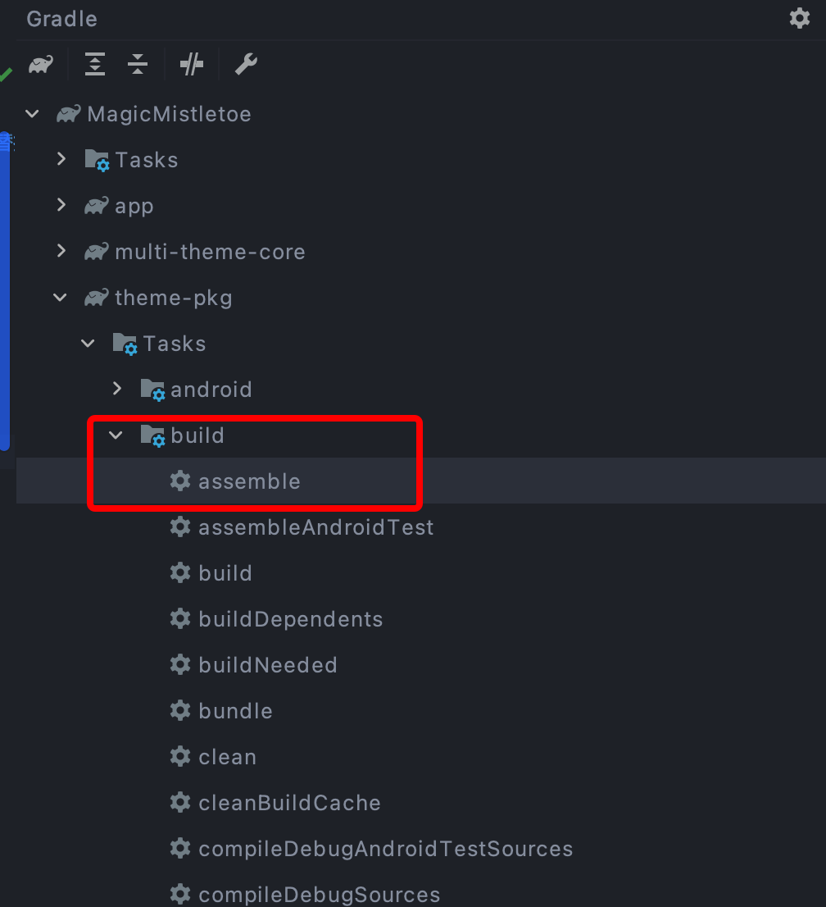
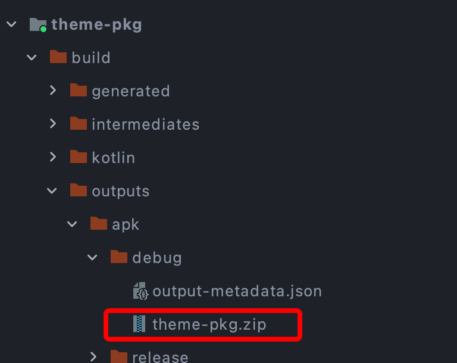

### Magic Mistletoe Android多主题（换肤）切换框架 [](https://jitpack.io/#mistletoe5215/MagicMistletoe)

  #### 背景
 
  > 时隔四年，在网易换肤之前的思路下，做了几点改进，现在完全通过反射创建View，并且在`SkinLoadManager`中提供一个`configCustomAttrs`以支持自定义View的属性插队替换
  
  > 摈弃了之前的`AsyncTask`,使用kotlin 协程进行主题包的资源转换
  
  > 使用kotlin重构所有Java代码实现

  #### 效果展示
   
  > 默认主题
  
  
  > 点击切换主题
  
  
  #### 最佳使用方式
  > STEP 1 宿主项目(示例Demo为本项目`app`模块)依赖多主题框架AAR
 
   ```groovy
   //in root build.gradle
   allprojects {
 		repositories {
 			maven { url 'https://jitpack.io' }
 		}
 	}
   // in app/module build.gradle
   dependencies {
   	        implementation 'com.github.mistletoe5215:MagicMistletoe:1.0.0'
   	}
 
  ```

  > STEP 2 制作多主题包 
 
  > 找个壳工程，在res下放置资源文件，`注意` 资源文件名称需要与`宿主app`内的资源文件名称保持一致，这样主题切换的时候才可以成功替换
  
  > 执行打包命令
  
  > 找到生成的资源apk
  
  > 重命名为`你喜欢的名字.zip`（如果有强迫症）
  
  > 这里是做演示，（实际商用过程中，可将zip包给服务端，进行主题包签名处理，后通过下载的形式down到本地，解签，应用）拷贝主题文件至`宿主app`的assets目录下
  
  > 释放assets目录主题文件至私有路径
  ```kotlin
     private fun copyAssetAndWrite(fileName: String): Boolean {
            try {
                val cacheDir = cacheDir
                if (!cacheDir.exists()) {
                    cacheDir.mkdirs()
                }
                val outFile = File(cacheDir, fileName)
                if (!outFile.exists()) {
                    val res = outFile.createNewFile()
                    if (!res) {
                        return false
                    }
                } else {
                    if (outFile.length() > 10) { 
                        return true
                    }
                }
                val `is`: InputStream = assets.open(fileName)
                val fos = FileOutputStream(outFile)
                val buffer = ByteArray(1024)
                var byteCount: Int
                while (`is`.read(buffer).also { byteCount = it } != -1) {
                    fos.write(buffer, 0, byteCount)
                }
                fos.flush()
                `is`.close()
                fos.close()
                return true
            } catch (e: IOException) {
                e.printStackTrace()
            }
            return false
        }
  ```
 > STEP 3 代码执行切换

 ```kotlin
    /**
     * 在Application中初始化多主题框架
     **/ 
    SkinLoadManager.getInstance().init(application)
    /**
     * Activity onCreate 前设置`multiThemeFactory`
     **/
    registerActivityLifecycleCallbacks(object : ActivityLifecycleCallbacks {
               override fun onActivityPreCreated(activity: Activity, savedInstanceState: Bundle?) {
                   super.onActivityPreCreated(activity, savedInstanceState)
                   activity.layoutInflater.factory = SkinLoadManager.getInstance().multiThemeFactory
               }
   
               override fun onActivityCreated(activity: Activity, savedInstanceState: Bundle?) {
   
               }
   
               override fun onActivityStarted(activity: Activity) {
   
               }
   
               override fun onActivityResumed(activity: Activity) {
   
               }
   
               override fun onActivityPaused(activity: Activity) {
   
               }
   
               override fun onActivityStopped(activity: Activity) {
   
               }
   
               override fun onActivitySaveInstanceState(activity: Activity, outState: Bundle) {
   
               }
   
               override fun onActivityDestroyed(activity: Activity) {
   
               }
   
           })
     /**
      * 换肤前，将换肤包从assets目录拷入应用内
      **/
     ArchTaskExecutor.getIOThreadExecutor().execute {
                copyAssetAndWrite(fileName)
                ArchTaskExecutor.getMainThreadExecutor().execute {
                    Toast.makeText(this,"成功",Toast.LENGTH_SHORT).show()
                }
     }
     /**
      * 传入拷贝后的多主题路径，执行多主题切换
      **/
     val dataFile = File(cacheDir, fileName)
     SkinLoadManager.getInstance().loadSkin(dataFile.absolutePath, object : ILoadListener {
                       override fun onStart() {
                           Log.i("Mistletoe", "onStart")
                       }
   
                       override fun onSuccess() {
                           Log.i("Mistletoe", "onSuccess")
                       }
   
                       override fun onFailed(e: SkinLoadException) {
                           Log.e("Mistletoe", "onFailed:${e.message}")
                       }
   
    })
      /**
       * 切换回App默认主题
       **/
     SkinLoadManager.getInstance().restoreDefaultTheme()
```